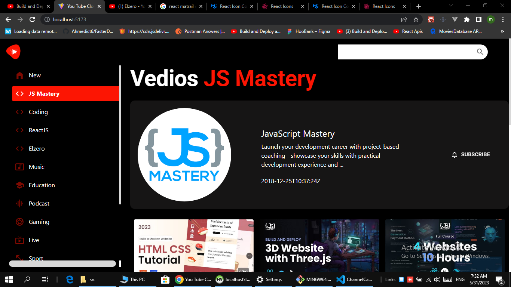

## React Clone Youtube As Traing On Fetch Data

### Tech ON This Projec

1. React
2. React Route
3. React Axios
4. React Icons
5. Matrail Desgin


How U Can Run TO Dev

```
npm install
npm Run Dev
```

How U Can Run TO Deployments

```
npm install
npm Run Bulid
```

## Screenshots


